# KBO Score Analysis

KBO Score Analysis is a project designed to analyze and visualize Korean Baseball Organization (KBO) league data, focusing on batting and pitching statistics from 2015 to 2022.

## Directory Structure

```mermaid
graph TD
    A[KBO-Score/] --> B[README.md]
    A --> C[R_Code.R]
    A --> D[Datasets/]
    D --> E[2015 data/]
    D --> F[2016 data/]
    D --> G[2017 data/]
    D --> H[2018 data/]
    D --> I[2019 data/]
    D --> J[2020 data/]
    D --> K[2021 data/]
    D --> L[2022 data/]
    E --> M[2015_league_batting.csv]
    E --> N[2015_league_pitching.csv]
    F --> O[2016_league_batting.csv]
    F --> P[2016_league_pitching.csv]
    G --> Q[2017_league_batting.csv]
    G --> R[2017_league_pitching.csv]
    H --> S[2018_league_batting.csv]
    H --> T[2018_league_pitching.csv]
    I --> U[2019_league_batting.csv]
    I --> V[2019_league_pitching.csv]
    J --> W[2020_league_batting.csv]
    J --> X[2020_league_pitching.csv]
    K --> Y[2021_league_batting.csv]
    K --> Z[2021_league_pitching.csv]
    L --> AA[2022_league_batting.csv]
    L --> AB[2022_league_pitching.csv]
```



```
arnavagarwal-mr-ar-kbo-score/
├── README.md          # Project documentation
├── R_Code.R           # Core R script for data analysis
├── Datasets/          # Folder containing datasets for analysis
    ├── 2015 data/     # Batting and pitching data for 2015
    ├── 2016 data/     # Batting and pitching data for 2016
    ├── 2017 data/     # Batting and pitching data for 2017
    ├── 2018 data/     # Batting and pitching data for 2018
    ├── 2019 data/     # Batting and pitching data for 2019
    ├── 2020 data/     # Batting and pitching data for 2020
    ├── 2021 data/     # Batting and pitching data for 2021
    └── 2022 data/     # Batting and pitching data for 2022
```

## Features

- **Historical Data Analysis**: Analyze batting and pitching statistics for KBO league teams from 2015 to 2022.
- **Visualization**: Generate insightful visualizations for key performance metrics.
- **Customizable Analysis**: Modify the R script to adapt to additional datasets or specific analytical needs.

## Getting Started

### Prerequisites

- [R](https://www.r-project.org/) (version 4.0 or higher)
- Required R packages:
  - `ggplot2`
  - `dplyr`
  - `tidyr`

Install required packages with:

```R
install.packages(c("ggplot2", "dplyr", "tidyr"))
```

### Running the Script

1. Clone the repository:

   ```bash
   git clone https://github.com/ArnavAgarwal-Mr-AR/KBO-Score.git
   ```

2. Open the R script `R_Code.R` in your R environment.
3. Execute the script to process the datasets and generate visualizations.
4. Outputs, including plots, will be displayed or saved as needed.

## Repository Contents

- **R_Code.R**: Contains the core R script for processing and analyzing datasets.
- **Datasets/**: Organized folder structure with batting and pitching data for each year from 2015 to 2022.

## Contributing

Contributions are welcome! To contribute:
1. Fork the repository.
2. Create a new branch (`feature/your-feature-name`).
3. Commit your changes (`git commit -m 'Add new feature'`).
4. Push to the branch (`git push origin feature/your-feature-name`).
5. Open a Pull Request.

## License
This project is licensed under the MIT License. See the [LICENSE](LICENSE) file for details.

## Contact me 📪
<div id="badges">
  <a href="https://www.linkedin.com/in/arnav-agarwal-571a59243/" target="blank">
   
  </a>
 <a href="https://www.instagram.com/arnav_executes?igsh=MWUxaWlkanZob2lqeA==" target="blank">
 
 </a>
 </a>
 <a href="https://medium.com/@arumynameis" target="blank">
 
 </a>
</div>

